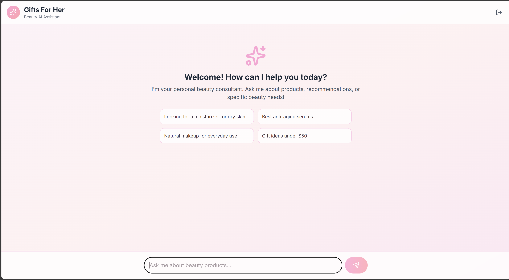
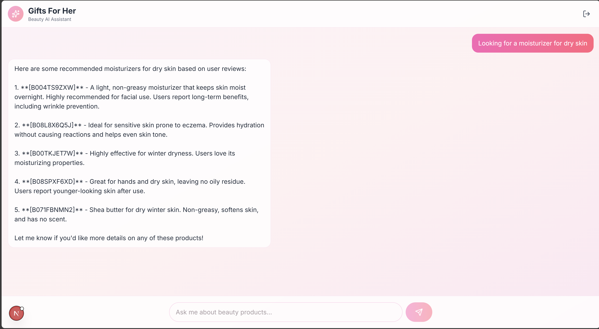

# Gifts-For-Her-MastraAI-Chat

App deployed in vercel: https://gifts-for-her-mastra-ai-chat.vercel.app/

Screenshots:






## AI Beauty Product Advisor 💄
An intelligent, AI-powered recommendation engine that finds the perfect beauty products by analyzing real user reviews and product metadata. Built with Next.js, Mastra AI, and Pinecone.

### 🌟 Overview
Traditional product search often relies on keywords. This application uses Semantic Search to understand the intent and sentiment behind user queries. Whether a user asks for "something for sensitive skin that smells like vanilla" or "the best heavy-duty moisturizer for winter," the agent finds products based on actual human experiences (reviews) rather than just marketing descriptions.

### 🛠️ Tech Stack
Frontend: Next.js 15 (App Router)

AI Framework: Mastra AI

Vector Database: Pinecone

Storage: MongoDB

Embedding Model: Azure OpenAI (text-embedding-3-small)

Styling: Tailwind CSS

## 📊 Data Source & Ingestion
The application utilizes the [Amazon Reviews 2023 dataset](https://huggingface.co/datasets/McAuley-Lab/Amazon-Reviews-2023) from the McAuley-Lab on HuggingFace.

Processing Workflow:

1) Extraction: Downloaded the all_beauty category (products and reviews).

2) Transformation: Extracted metadata (ASINs, titles, ratings) and text descriptions.

3) Loading: Vectorized the data using Azure OpenAI and stored them in two distinct Pinecone indexes:

- amazon-beauty-reviews: Contains granular review text.

- amazon-beauty-items: Contains high-level product specifications.

## 🧠 AI Agent Architecture: 2-Step Retrieval
The Mastra AI agent follows a sophisticated RAG (Retrieval-Augmented Generation) pipeline to ensure recommendations are grounded in social proof:

1. Semantic Review Search
When a user submits a query, the agent performs a vector search against the amazon-beauty-reviews index. This identifies what people are actually saying about products that match the user's needs.

2. Product ID Cross-Reference
From the top relevant reviews, the agent extracts the parent_asin (Product ID) from the metadata. It then performs a direct ID lookup in the amazon-beauty-items index to fetch the most up-to-date product titles, descriptions, and details.

## 🚀 Getting Started
Prerequisites
- Node.js 20+
- Pinecone API Key
- Azure OpenAI Instance (with text-embedding-3-small deployment)
- MongoDB (For storage)

Installation
1) Clone the repository:


```
git clone https://github.com/yxuan1996/Gifts-For-Her-MastraAI-Chat.git
cd gifts-for-her
```
Install dependencies:

```
npm install
```

Set up environment variables: Create a .env file in the root


Run the development servers:

This command will start the Mastra UI at port 4111 and the frontend at port 3000
```
npm run dev
```

## 📂 Project Structure

```
/app: Next.js frontend components and API routes.

/src/mastra: Mastra AI agent configurations, tools, and integration logic.

/lib: Shared utility functions for Pinecone and Azure OpenAI.
```